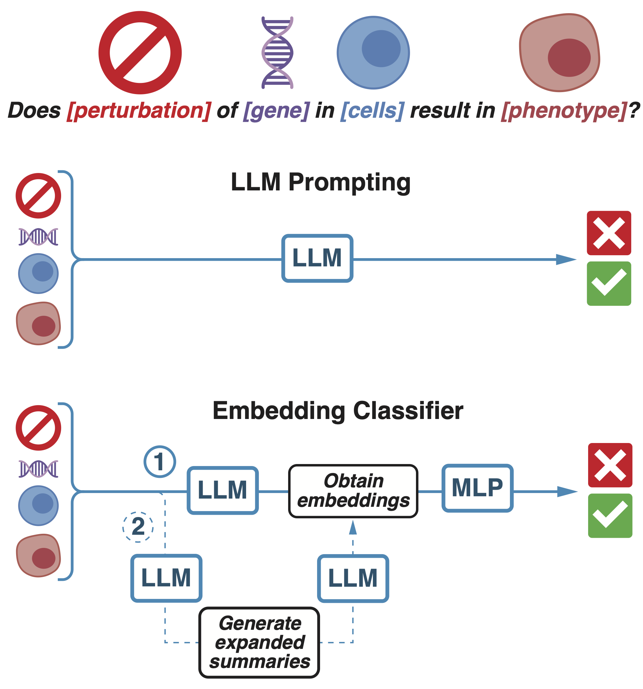

# VirtualCRISPR
Virtual CRISPR Code and benchmark datasets for predicting CRISPR screen results with LLMs, as described in "Virtual CRISPR: Can LLMs Predict CRISPR Screen Results?" for the BioNLP workshop at ACL 2025 ([link to paper](https://aclanthology.org/2025.bionlp-1.30/)).



Model | AUROC | AUPRC | F1 | FPR | PPV | NPV | Sens. | Spec.
-|-|-|-|-|-|-|-|-
GPT-4o (prompting) | N/A | N/A | 0.35 ± 0.17 | 0.79 ± 0.19 | 0.32 ± 0.14 | 0.23 ± 0.13 | 0.41 ± 0.22 | 0.21 ± 0.19
**Raw Emb.** | **0.89** | **0.86** | **0.84** | **0.15** | **0.85** | **0.83** | **0.83** | **0.85**
Summ. Emb. | 0.72 | 0.69 | 0.67 | 0.26 | 0.71 | 0.67 | 0.64 | 0.74

Performance on the Difficult CRISPR screen benchmark. Compares the embedding-based classifier using embeddings of raw text (Raw Emb.) or embeddings of GPT-4o summaries (Summ. Emb.) against GPT-4o direct prompting (results aggregated across prompting strategies). Standard classification metrics reported. GPT-4o prompting gives binary outputs and thus AUROC and AUPRC are undefined. Best model highlighted. Please see our paper for further details.

### Citation
```
@inproceedings{song2025virtual,
  title={Virtual CRISPR: Can LLMs Predict CRISPR Screen Results?},
  author={Song, Steven and Abdrabou, Abdalla and Dabholkar, Asmita and Day, Kastan and Dharmoju, Pavan and Perera, Jason and Kindratenko, Volodymyr and Khan, Aly A},
  booktitle={Proceedings of the 24th Workshop on Biomedical Language Processing},
  pages={354--364},
  year={2025}
}
```

### Setup
```bash
conda env create -f env.yml
conda activate crispr
```

### Data Download
All data for benchmarking and prompting is contained within this repository.

<details>
<summary>Additional data download is only necessary for training embedding based models. Expand this section for more details.</summary>
<br>

Source data and precomputed LLM-derived embeddings can be downloaded from this [Box link](https://uchicago.box.com/s/4663twrg8j1l5n1hrp74oyiikjjqv6sr). Extract the contents of the tarball to `embedding/data`. The resulting folder structure should be:
 
```
<repo_root>
├── benchmarks
├── embedding
│   ├── configs
│   ├── data
│   │   ├── embeddings
│   │   ├── eval
│   │   ├── screens
│   │   ├── summaries
│   │   └── terms
|   └── [...]
└── [...]
```

</details>

### Table of Contents
1. **Benchmarks**: Benchmarks for in-silico CRISPR screen prediction task.
    * Data and utilities for loading prepared benchmarks.
2. **Prompting**: Prediction via prompting of LLMs.
    * Run scripts for prompting models served locally, by OpenAI, or other custom providers.
    * Source code and prompt templates for prompting LLMs.
    * Notebooks for computing evaluation metrics and generating plots.
3. **Embedding**: Training and inferencing models using LLM-derived embeddings.
    * Utilities for extracting, summarizing, and embedding training data derived from BioGRID-ORCS (numbered notebooks/scripts in [`embedding/preprocessing`](embedding/preprocessing)).
    * Source code and training configurations for training different embedding based models. Configurations in [`embedding/configs`](embedding/configs). Train using:
        ```bash
        cd embedding
        python src/train.py fit --config <config_file>
        ```
    * Notebooks for inferencing, computing evaluation metrics, and generating plots.

### Reference Genomes

Reference genomes were downloaded from NCBI (columns were manually renamed after download to align across data):
```bash
datasets summary gene taxon "homo sapien" --as-json-lines | dataformat tsv gene --fields symbol,gene-id,gene-type > genome_homo_sapiens.tsv

datasets summary gene taxon "mus musculus" --as-json-lines | dataformat tsv gene --fields symbol,gene-id,gene-type > genome_mus_musculus.tsv
```

### Implementation Notes
* **Prompting**:
    * `llama-2` changed `system` roles to `user` for messages and merged multiple consecutive messages from single role into single message
    * `o1-mini` changed `system` roles to `user` for messages
    * `o1` and `o1-mini` do not allow explicit chain-of-thought and sampled with specific parameters
    * OpenAI models run with 4 parallel requests
    * local Llama models run with 32 parallel requests
    * 70B models served with vLLM tensor-parallel across 2x A100 80GBs with flags as-above to make models fit with otherwise default parameters
    * all other local models served with vLLM on single A100 80GB with default parameters
